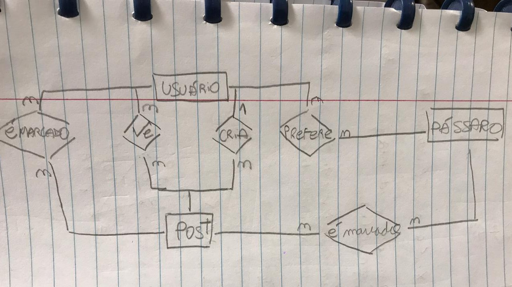
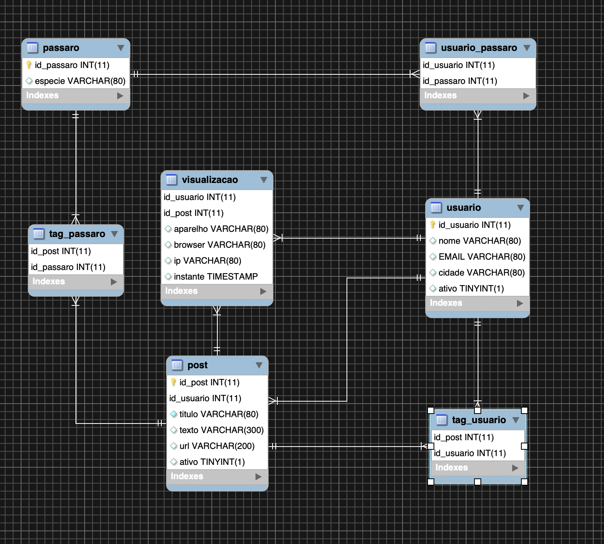
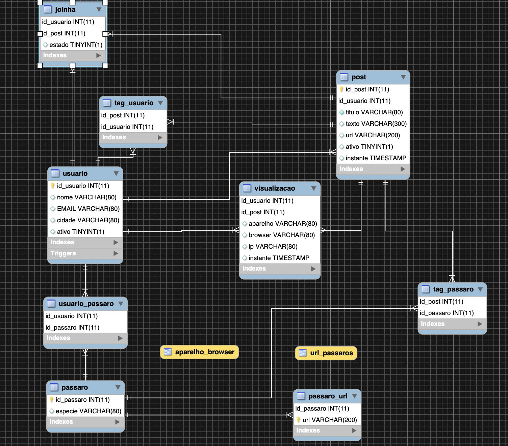

# MegaDados Rede Social passaros

O projeto é uma pequena rede social que envolve pássaros, em que os usuários podem comentar entre eles e marcar diferentes tipos de pássaros.

# Dicionário de Dados 
Para explicar o nosso modelo foi necessário criar entidades(tabelas) para conseguir ter controle dos testes a serem feitos passados no enunciado, resultando em 7 entidades. Contando com o fato de que uma das entidades é uma view. 
Atulizando o dicinário para a segunda fase da entrega, concluí-se que o projeto teria mais 2 tabelas amais, além de duas views.

## Joinha
| joinha | tipo | PK |    FK |
| ---    | ---  | ---| --- |
| id_usuario    | INT(11)|X|X|
| id_post       | INT(11)|X|X|
| estado        | TINYINT| | | 

## Pássaro_URL
| passaro_url | tipo | PK| FK|
| --- | --- | ---| --| 
| id_passaro | INT(11)|X|X|
| URL | VARCHAR(200)|X| |


## Pássaro
| passaro | tipo | PK| FK|
| --- | --- | ---| --|
| id_passaro | INT(11)|X|
| especie | VARCHAR(80)| |  

A entidade pássaros será responsável por guardar o id dos mesmos e qual é o tipo da espécie. Restrição: não é possível adicionar espécies com o mesmo nome, o id é incrementado automaticamente.


## Usuário_pássaro
| usuario_passaro | tipo | PK  | FK|
| ---             | ---  | --- |---|   
| id_usuario | INT(11)   | X   | X | 
| id_passaro | INT(11)   | X   | X |

A entidade usuario_passaro é uma tabela relacional entre a entidade Pássaros e a entidade Usuário. 

## Usuário
| usuario | tipo | PK| FK |
| --- | --- | ---|---|
| id_usuario | INT(11) |X|
| nome | VARCHAR(80)   | |
| EMAIL| VARCHAR(80)   | |
| cidade| VARCHAR(80)  | | 
| ativo | TINYINT(1)|  | |

A entidade usuário é responsável por guardar informações importantes do usuário como nome, localização e endereço de email, além de saber se o usuário está ativo na rede ou não. Em updates das tabela usuário, verifica-se o status ativo do usuário em questão: caso este update torne o usuário inativo, foi criado um trigger responsável por indicar que os posts deste usuário também estão inativos.


## Visualização

| visualizacao | tipo | PK| FK
| --- | --- | ---| ---|
| id_usuario | INT(11) | X | X
| id_post | INT(11) | X | X
| aparelho| VARCHAR(80)| |
| browser| VARCHAR(80)| |
| ip | VARCHAR(80)| |
| instante | TIMESTAMP| |

A entidade visualização é responsável por pegar as informações do usuário como qual aparelho está sendo utilizado, qual browser foi feita a pesquisa, seu ip e o momento e dar display delas. 

## Post

| post| tipo| PK|  FK
| --- | --- | ---| ---|
| id_usuario | INT(11) |  X | X| 
| id_post    | INT(11)     | X|
| titulo     | VARCHAR(80) |  |
| texto      | VARCHAR(300)|  |
| url        | VARCHAR(200)|  |
| ativo      | TINYINT (1) |  | 

A entidade post guarda os posts realizados na nossa rede social, eles incluem um título, um texto e uma url fonte. Além disso é possível saber se o post está ativo ou não, isto é, se ele foi deletado logicamente da nossa base ele simplesmente não está ativo. 

## Tag_Usuario

| tag_usuario| tipo| PK|  FK
| --- | --- | ---| ---|
| id_post    | INT(11)    | X | X 
| id_usuario | INT(11)    | X | X

A entidade Tag_usuario tem a função de guardar a tag de um usuário assim que este mesmo for comentado em algum post. Dessa forma, guarda-se o id do post e o id do usuário nesta tabela.

## Tag_Passaro

| tag_passaro| tipo| PK|  FK
| --- | --- | ---| ---|
| id_post    | INT(11)    | X | X 
| id_passaro | INT(11)    | X | X

A entidade Tag_Passaro tem a função de guardar a tag de um pássaro assim que este mesmo for comentado em algum post. Dessa forma, guarda-se o id do post e o id do pássaro nesta tabela.


# Schema

A partir do enunciado e da ideia de modelos relacionais, foi possível juntar o nosso dicionário e formar o seguinte modelo entidade-relacional:
### Fase 1





### Fase 2




# Testes

Para verificar se os scripts SQL estão corretos, utilizaremos o unittest e o subprocess. O primeiro irá facilitar na criação de testes, enquanto o subprocess será responsável por nos ajudar a automatizar nossa aplicação. 

Isso pois é possível utilizar o o subprocess para criar uma conexão do mysql utilizando um script.py como segue o exemplo:

```python
import subprocess
import unittest

class TestCase(unittest.TestCase):
    def test_meu_teste(self):
        pass
    @classmethod
    def setUpClass(TestCase):
        with open ('script.sql', 'rb') as f:
            res = subprocess.run('mysql -u root -proot'.split(),stdin =f)
            print(res)        

if __name__ = '__main__':
    unittest.main()

```

 No nosso caso a automatização teve um problema. O arquivo de testes deveria rodar todos os scripts de criação de tables e triggers antes dos testes. No entanto, percebe-se que não é isto que está acontecendo, sendo necessário rodar os scripts manualmente antes de rodar os testes. Para evitar este transtorno, colocamos temporariamente um nome errado no projeto do arquivo tear down (para evitar que o banco seja destruído e os scripts tenham de ser rodados manualmente).

 Todas as funções de implementação estão no arquivo projeto.py e os testes do mesmo estão no arquivo test_projeto.py
 
 Como forma de apresentação vamos mostrar a implementação de uma das funções feitas no projeto :
 ```python
 import pymysq

 def remove_usuario(conn, id_usuario):
    with conn.cursor() as cursor:
        try:
        	cursor.execute('UPDATE usuario SET ativo = False WHERE id_usuario=%s', (id_usuario))
        except pymysql.err.IntegrityError as e:
            raise ValueError(f'Não posso remover usuario de id {id} na tabela usuario')
 ```

 A função acima realiza o UPDATE no nosso banco sql deixando o usuário inativo, isto é, realizar um DELETE lógico no mesmo. Pois é mais interessante ainda guardar o usuário inativo, já que atulizar o tamanho do banco nesse sentido é muito custoso e desnecessário.
 Ainda assim, foi necessário criar um teste para ver se as funções, incluindo esta acima, estavam funcionando corretamente. 
 ```python
 import io
import json
import logging
import os
import os.path
import re
import subprocess
import unittest
import pymysql
from projeto import 

def test_remove_usuario(self):
        conn = self.__class__.connection
        email = '@'
        cidade = 'SP'
        adiciona_usuario(conn, 'Gustavo', email, cidade)
        id = acha_usuario(conn, 'Gustavo')

        res = lista_usuarios(conn)
        self.assertCountEqual(res, (id,))

    
        #Inserimos algum posts
        titulo = 'Primeiro post'
        texto = titulo
        url = 'https://'
        adiciona_post(conn, titulo, id, texto, url)

        #Guardamos o id do post
        id_post = acha_post(conn, id, titulo)
        #Removemos o usuario
        remove_usuario(conn, id)

        #Checamos se ele foi desativado
        res = checa_ativo(conn, id)
        self.assertFalse(res)

        #Checamos se o post foi desativado
        res = checa_ativo_post(conn, id_post)
        self.assertFalse(res)

 ```

O teste acima foi projetado para testes a função de remover os usuários. Entretanto, é possível perceber que mais testes foram testados, já que para saber se um usuário foi deletado ou não, é necessário saber se ele estava ativo, e se ele realmente existe. Além disso, inserimos um post neste caso para mostrar que, ao desativar um usuário o post é deletado logicamente também, estando no banco mas não sendo mostrado por ter a variável de atividade negada. 


## REST 

Além dos testes, a segunda fase pediu com que utilizássemos um modelo de REST API para conversar com as funções que já tinham sido implementadas. Assim para cada função feita, criou-se um EndPoint e um método em REST para conversar com a API via a url desse EndPoint. Foi possível realizar tudo deste jeito pois é só atrelar o que as queries no SQL estáo fazendo por função. Assim, quando dermos um SELECT em alguma função, o objetivo no REST será dar um GET que irá listar as opções desejadas da URL definida pelos parâmetros.
Dessa forma é possível simular uma aplicação real criando testes específicos para os endpoints criados. 
Utilizamos a recomendação do professor que é uma biblioteca para python desenvolvida em go e node.js chamada fastAPI.  


